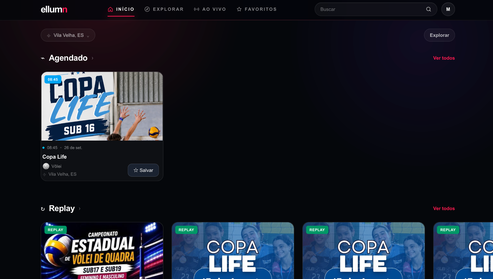
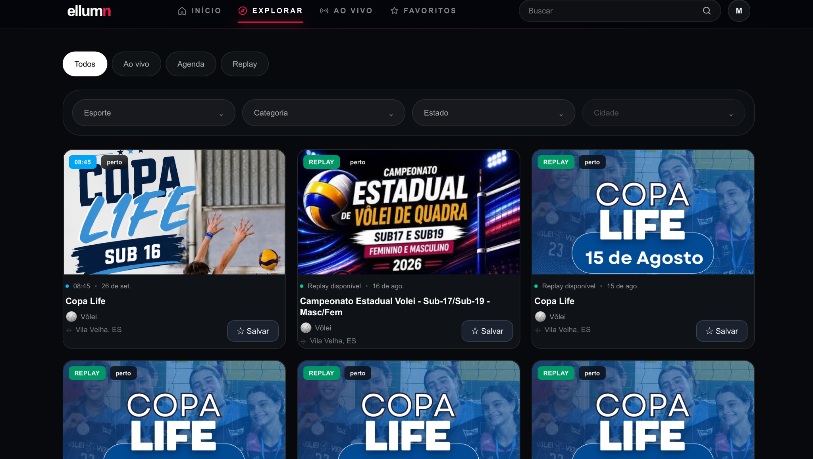
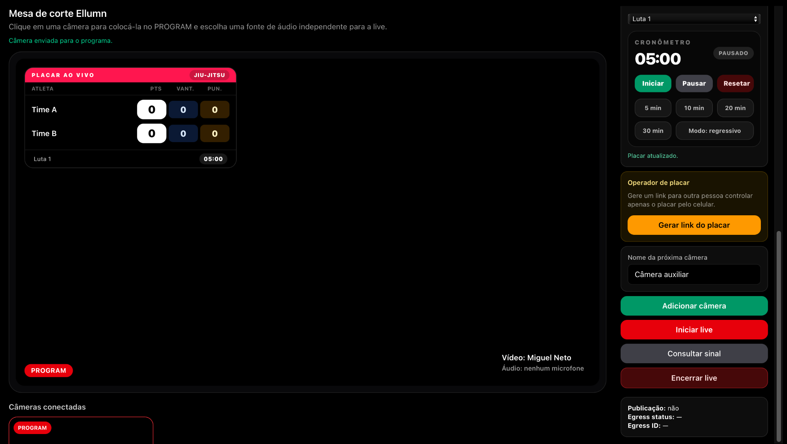

# Ellumn Platform

Ellumn is a production sports-event and live-streaming platform that I designed and developed independently, covering product architecture, frontend, backend, database, authentication, infrastructure, and third-party integrations.

🌐 **Live platform:** https://ellumn.com

> The production repository is private and actively maintained.  
> This public repository documents selected architecture decisions, technical challenges, and product capabilities without exposing production source code or sensitive infrastructure details.

## Overview

Ellumn was built to support the management and live broadcasting of sports events through a unified platform.

The platform combines event management, athlete and competition workflows, live video infrastructure, scoreboard operations, and third-party streaming integrations.

I designed and implemented the platform end-to-end, including application architecture, backend APIs, database modeling, authentication, authorization, external integrations, deployment, and production support.

## Product Preview

### User Experience

The public experience allows users to discover scheduled events, live broadcasts, and replay content.



### Event Discovery

Events can be explored and filtered by availability, sport, category, location, and broadcast status.



### Live Production & Scoreboard Operations

The production interface combines camera switching, live-program control, sport-specific scoreboards, timers, remote scoreboard operation, and broadcast lifecycle controls.



## Tech Stack

### Application
- Next.js
- React
- TypeScript
- Tailwind CSS

### Backend & Data
- Next.js API routes
- Supabase
- PostgreSQL
- Authentication and authorization
- Database migrations

### Streaming & Integrations
- LiveKit
- YouTube / Google APIs
- Multi-camera streaming workflows
- Live broadcast management

### Infrastructure & Operations
- Vercel
- Environment-based configuration
- Analytics and performance monitoring
- Production deployment and ongoing maintenance

## Main Capabilities

- Sports event creation and management
- Athlete and organization management
- Competition registration workflows
- Matches and fight management
- Live scoreboard operations
- Multi-camera live streaming
- Stream operator workflows
- YouTube integration and synchronization
- Role-based access control
- Dashboards and administrative workflows
- Production monitoring and analytics

## Engineering Scope

As the independent developer of the platform, I have worked across:

- Application and system architecture
- Frontend and backend development
- API design
- PostgreSQL data modeling
- Authentication and authorization
- Third-party API integrations
- Live video infrastructure
- Database migrations
- Deployment and production operations
- Debugging, maintenance, and continuous product evolution

## Architecture

A simplified architecture diagram will be added here.

The production architecture includes:

```text
Users
  |
  v
Next.js Application
  |
  +--> Authentication / Authorization
  |
  +--> Backend API Routes
  |       |
  |       +--> Supabase / PostgreSQL
  |       +--> YouTube APIs
  |       +--> LiveKit
  |
  +--> Streaming & Operator Workflows
  |
  +--> Vercel Production Deployment
