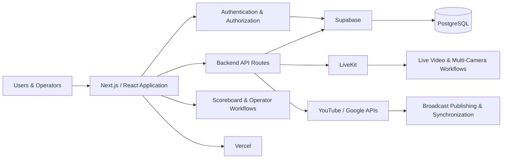

# Ellumn Platform

Ellumn is a production sports-event and live-streaming platform that I designed and developed independently, covering product architecture, frontend, backend, database, authentication, infrastructure, and third-party integrations.

🌐 **Live platform:** https://ellumn.com

> The production repository is private and actively maintained.  
> This public repository documents selected architecture decisions, technical challenges, and product capabilities without exposing production source code or sensitive infrastructure details.

## Overview

Ellumn was built to support the management and live broadcasting of sports events through a unified platform.

The platform combines event management, athlete and competition workflows, live video infrastructure, scoreboard operations, and third-party streaming integrations.

I designed and implemented the platform end-to-end, including application architecture, backend APIs, database modeling, authentication, authorization, external integrations, deployment, and production support.

## Product Preview

### User Experience

The public experience allows users to discover scheduled events, live broadcasts, and replay content.

### Event Discovery

Events can be explored and filtered by availability, sport, category, location, and broadcast status.

### Live Production & Scoreboard Operations

The production interface combines camera switching, live-program control, sport-specific scoreboards, timers, remote scoreboard operation, and broadcast lifecycle controls.

## Tech Stack

### Application

- Next.js
- React
- TypeScript
- Tailwind CSS

### Backend & Data

- Next.js API routes
- Supabase
- PostgreSQL
- Authentication and authorization
- Database migrations

### Streaming & Integrations

- LiveKit
- YouTube / Google APIs
- Multi-camera streaming workflows
- Live broadcast management

### Infrastructure & Operations

- Vercel
- Environment-based configuration
- Analytics and performance monitoring
- Production deployment and ongoing maintenance

## Main Capabilities

- Sports event creation and management
- Athlete and organization management
- Competition registration workflows
- Matches and fight management
- Live scoreboard operations
- Multi-camera live streaming
- Stream operator workflows
- YouTube integration and synchronization
- Role-based access control
- Dashboards and administrative workflows
- Production monitoring and analytics

## Engineering Scope

As the independent developer of the platform, I have worked across:

- Application and system architecture
- Frontend and backend development
- API design
- PostgreSQL data modeling
- Authentication and authorization
- Third-party API integrations
- Live video infrastructure
- Database migrations
- Deployment and production operations
- Debugging, maintenance, and continuous product evolution

## Architecture

Ellumn uses a web-first architecture that combines application logic, persistent data, authentication, real-time video infrastructure, and external streaming integrations.

### Architectural Responsibilities

- **Next.js / React** — user-facing application, dashboards, operator interfaces, and server-side application logic
- **Backend API routes** — application workflows and external integrations
- **Supabase / PostgreSQL** — authentication, persistent data, relational modeling, and migrations
- **LiveKit** — real-time video and multi-camera workflows
- **YouTube / Google APIs** — broadcast integration and synchronization
- **Vercel** — production deployment and application delivery

## Engineering Decisions & Challenges

Building Ellumn as an end-to-end production platform required solving problems across application development, data modeling, streaming, integrations, and operations.

### Real-Time Video Workflows

Live video is handled through LiveKit, supporting camera participation and production workflows while keeping broadcast control separated from the public viewing experience.

### Multi-Camera Production

The production interface was designed to allow operators to manage connected cameras, select the program feed, control audio sources, and coordinate live broadcast operations from a unified interface.

### Sport-Specific Scoreboards

The platform includes scoreboard workflows that can adapt to different sports and competition formats, including timers, scoring rules, penalties, advantages, and remote operator controls.

### Data & Application Architecture

PostgreSQL is used as the relational data layer, with Supabase supporting authentication, authorization, and application data workflows.

Database evolution is managed through migrations to keep application changes reproducible across environments.

### External Integrations

Ellumn integrates with external services such as LiveKit and YouTube / Google APIs while keeping credentials and sensitive configuration isolated through environment-based configuration.

### Production & Continuous Evolution

The production codebase is actively maintained and continuously evolves as new product capabilities, streaming workflows, competition features, and operational improvements are introduced.

## Why the Production Repository Is Private

Ellumn is an active production platform.

The production source code and infrastructure configuration remain private to avoid exposing:

- Authentication and authorization internals
- Database and security policies
- Private API integrations
- Infrastructure configuration
- Operational implementation details
- Production credentials and environment configuration

This repository focuses instead on architecture, engineering decisions, product capabilities, and selected technical evidence.

## Current Development

The production codebase is under active development and receives frequent updates as new capabilities, integrations, streaming workflows, and operational improvements are introduced.

## About the Developer

Built independently by **Miguel Vieira Neto**.

Senior Software Engineer & Technical Lead with experience across backend systems, PostgreSQL, cloud infrastructure, production systems, web applications, and technical leadership.

- GitHub: https://github.com/miguelvneto
- LinkedIn: https://www.linkedin.com/in/miguel-neto1
- Platform: https://ellumn.com
